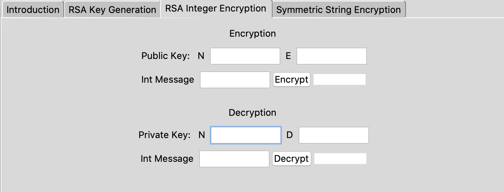

# RSA Public Key Encryption Tool

### Description
RSA public key encryption tool in Python that allows users to understand the process of generating and applying public and private keys to messages. Includes an interactive user interface using Tkinter.

### Usage

##### RSA Key Generation

##### RSA Integer Encryption

##### Symmetric String Encryption

### Screenshots

 
