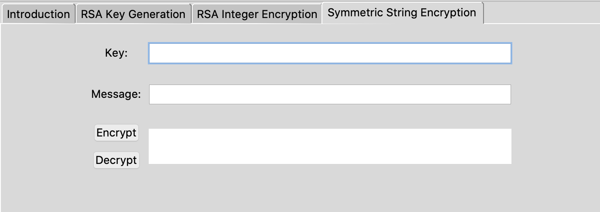

# RSA Public Key Encryption Tool

### Description
RSA public key encryption tool in Python that allows users to understand the process of generating and applying public and private keys to messages. Includes an interactive user interface using Tkinter.

### Usage

##### RSA Key Generation
Generates two prime numbers using an lower and upper bound of values. Then, generates a public and private key using these two primes. Results from this tab can be copied to the RSA Integer Encryption tab.

##### RSA Integer Encryption
Given RSA public or private keys, this tab and encrypt or decrypt integer messages.

##### Symmetric String Encryption
This tab can apply integer keys to encrypt or decrypt a string message using a symmetric cipher. Used in conjunction with the RSA encryption scheme to encrypt and decrypt strings more securely.

### Screenshots

 

 

 
